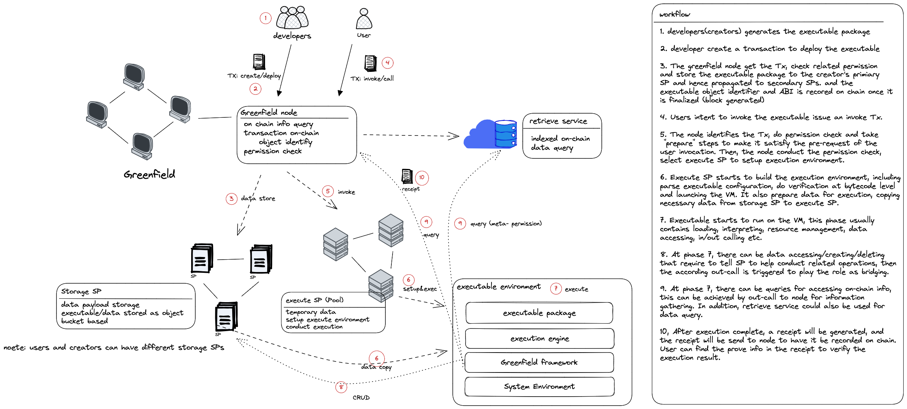
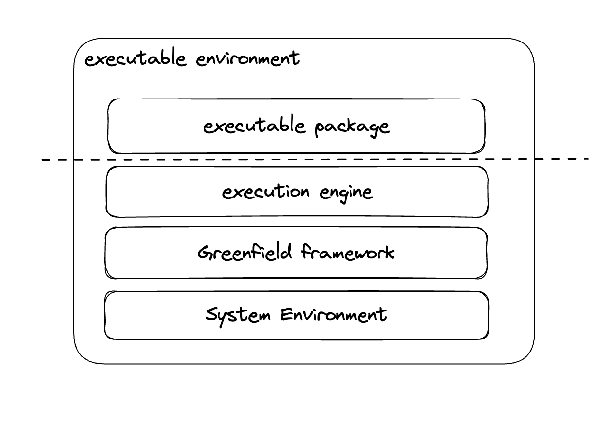
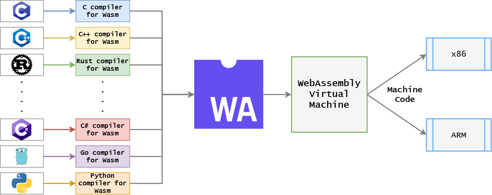
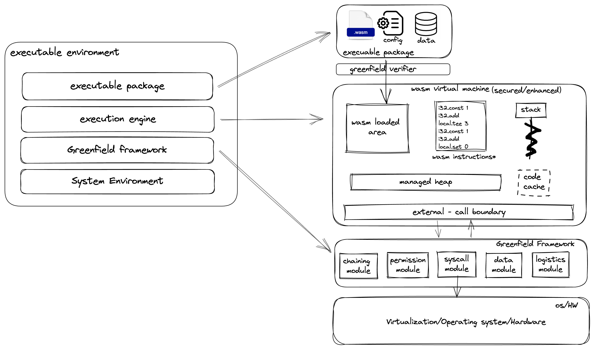
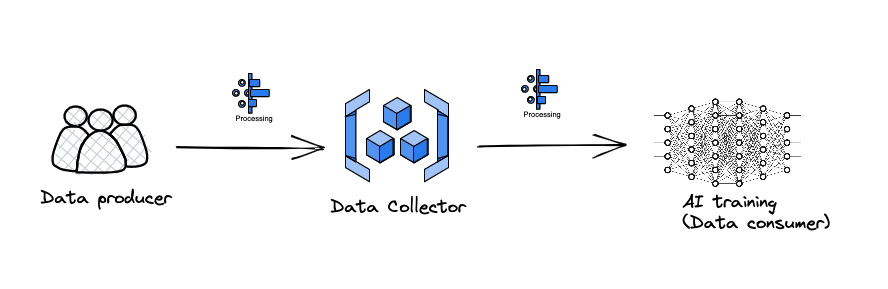

# Greenfield Executable (Design Proposal)

Requirement
-----------

### Basic capabilities

1. Support "Executable" data on Greenfield with access control
   1. Executable - The object with executable permission that conduct data operations
        1.  Reads the specific data or data snippets
        2.  Deletes exist data or create new data
        3.  Invokes other executables with data
        4.  Operates on data stored on greenfield storage SPs
        5.  Must have correct permissions of the data it operates on
        6.  Capable of performing all kinds of data operations
   2. Access control
        1.  Executable is an entity that takes access control of other data.
        2.  Limitations on the executable:
            1.  The executable can act on the data/content only if it is allowed.
            2.  The executable can invoke other executables only if it is allowed.
            3.  All system/native related behavior must be handled under control by the greenfield framework or SDK.
            4.  The executable can create/delete data only with granted access.
        3.  Capability of the executable
            1.  The executable is read-only code that cannot be dynamically changed at runtime.
            2.  The executable consumes gas fee to run operations (binary or micro-code) on the data.
            3.  The executable result is not constrained to be verified, meaning that it is not limited that the execution result must be on-chain for consensus, although the execution status is recorded on-chain.
2. Help build up Greenfield ecosystem from the programming language level
    1. Be the key-player of BSC ecosystem
        1. Prioritize data operation over token operation.
        2. Cover data processing scenarios as much as possible.
        3. Leverage the token chain (BSC) for any token operations and economics. 
    2. Provide programming language level support to build a friendly ecosystem
       1. Rust, Go (tinyGo), Assembly script, C
            1.  Targets towards WebAssembly
            2.  Provides Greenfield executable SDK APIs for each language
            3.  Standard API for calling Greenfield-related functions
       2. More languages (not in day one)
           1.  Popular languages to help widen the use case of Greenfield for web2/web3 and cover all kinds of data processing.
           2.  Limited capability of general-purpose programming languages
               1.  Java, JavaScript, Python, etc.
           3.  More generalized runtime environment for full-featured programming languages (long-term target).
3. Consolidate the security of data operations on greenfield
   1. Language level
        1.  Language should not allow unexpected behaviors without monitoring (syscall, io, etc)
        2.  Must avoid data leakage and unauthorized access
   2. Sandboxing
       1.  Ensure that a compromised system cannot create security holes in the virtual machine.
4. Principle - Open and Close
    1. The execution system should be open enough to satisfy different data computation requirements.
    2. The execution system should be closed enough to protect the data and code from misuse and leaks.
5. Execution proof mechanism 
   1. fraud-proof or validity-proof system should be in place to help users verify and challenge the execution results.

Design and architecture overview
--------------------------------

### Design Overview

* The executables are stored as objects in the creator's storage SPs, with metadata containing the configuration information of the executable to be used at runtime in the form of a package. The meta-info (hash) of the package will be recorded on-chain.
    1. The creation, invocation, and return of the executable will be recorded in the form of a transaction.
    2. The invocation is triggered by a transaction that specifies the executable, invocation type and parameters.
    3. The result contains a receipt that records the CPU/RAM usage, gas fee, and proof of execution, among other details. 

* The **permission** design principle for executables is to treat them as entities with permissions and to avoid runtime checks as much as possible to reduce complexity. During development, the developer grants the executable access rights to all the data it interacts with statically. Prior to invocation, the executable must have access to the data from the invoker or third-party data providers (note that neither the invoker nor the executable developer necessarily has permission for all touchable data). During runtime, only minimal checks are performed to avoid interrupting the program. Additionally, any newly generated data is granted access rights to the executable by default. The data is stored in the correct bucket at the end of execution.

* By default, the executable only has access to the data it is packaged with and the data whose access is granted to it specifically (static access). Once deployed, any third-party users/accounts can add or remove data access to the executable by submitting transactions(dynamic access). At runtime, the invoker can introduce new data access to the executable before running, for any data to be used during runtime (dynamic permission).

* A new copy-execute-destroy mode will be introduced. This mode will elect an executable service provider, set up the execution environment, copy the executable, and all necessary data into the execution environment (Prologue). Then, it will conduct the running process (Conduct), submit the results, and finally destroy the environment (Epilogue). Please see the following description of the three phases.

* To invoke an executable, the invoker sends Tx to greenfield. The Tx specifies the executable to be invoked, the input data, and the gas information. The greenfield will then identify the related service provider (SP) to set up the execution environment and invoke the executable. Upon completion, receipts will be generated and sent to the greenfield as a Tx.

* At runtime, the execution environment is deployed at the SP side as a sandbox, and the invoker pays gas to execute the contract. Part of the gas will be paid to execute SP for computation resources consumption, and part of the gas will be paid to the storage SP if new data is generated and stored. If the gas is exhausted during execution, the program will pause and create a "Pause" typed Tx, which notifies the invoker to charge the fee. The invoker can then decide whether to charge or not by sending a new Tx. Once the fee is paid, the executable will resume. If there is a lack of gas or pending timeout, the execute process will exit.

* At execution time, three phases are designed: **Prologue, Conduct, and Epilogue.**
    *   The Prologue handles preparatory work such as permission checks, data preparation, and environment setup. This includes selecting the executable SP, setting up the execution environment, copying all necessary data, performing gas checking, and launching the executable.
    *   The Conduct phase performs the actual execution work. It consumes gas, makes inside/outside calls, and handles pending/resume operations. It then generates results to return.
    *   The Epilogue handles result checking, data finalization, generating receipt transactions, destroying the execution environment, and updating the receipt on-chain.

* To protect against data/code leaks, the execution system should have permission control of the executable at runtime. This includes access checking, syscall monitoring, and out call guarding. Access checking can be fast and simple at runtime or even eliminated in production due to the permission check in the prologue.

* From SP's perspective, the executable and runtime can be provided as a FaaS service, where the invocation transaction acts as a trigger. Greenfield has no limitations on the deployment and implementation of the entire execution solution.

* The runtime system should introduce a mechanism for generating a proof of execution, and provide users with a way to verify and challenge it.

  

### workflow

  

1. Developers create the executable package by writing code and compiling it to a Greenfield-compatible executable binary (wasm). They then combine it with metadata to generate a package.

  

2. The developer creates a transaction to deploy the executable, using the transaction type "putObject" and marking the object as executable.

  

3. The Greenfield node receives the transaction, checks related permissions, and stores the executable package in the creator's primary storage provider (SP). It then propagates the package to secondary SPs. Once the package is finalized (the block generated), the executable object information (hash and metadata) and ABI are recorded on the chain.

  

4. Users who want to invoke the executable issue a transaction specifying the invocation metadata. This metadata contains the executable ID (address/hash), input parameters, and invocation type.

  

5. The node identifies the transaction, performs permission checks, and prepares it to satisfy the user's invocation pre-requests. It then conducts the prologue work, which includes the following permission checks (using on-chain information):

   * The invoker has the permission to run the executable
   * The executable has the permission to access the input data provided by invoker
   * The executable has permission to access its third-party shared data.

    After completing all the checks, the node randomly selects an execution SP to set up the execution environment.

6. Execute SP then starts to build the execution environment, which includes parsing the executable configuration, verifying bytecode (if necessary), configuring the execution engine, preparing all required data, and launching the VM (mainly the Prologue phase).

  

7. The executable runs on the VM during this phase, which usually involves loading, interpreting, resource management, data access, input/output calls, and more.

8. During phase 7, there may be data access, creation, or deletion that requires SP to conduct related data operations. In such cases, the corresponding out-call is triggered to act as a bridge.

9. In phase 7, queries for accessing on-chain information may occur (although this rarely happens due to the preparation steps in the prologue). This can be achieved by out-calling to the greenfield node for information gathering. Additionally, the meta service could also be used for data queries, especially when the node API is unstable due to network traffic, system throttling, API bandwidth, etc. Or when the data being queried cannot be grabbed on-chain directly. Please note that when Pause/resume happens at runtime, the executable will pause and then do an out-call to the greenfield framework, which creates the related TX and then waits for an incoming signal from the resume TX.

10. After execution is complete, a receipt is generated and sent to the node to be recorded on the chain. Users can find proof from the receipt to verify the execution result. If any data creation/deletion occurs at runtime, they will be finalized to storage SPs during this phase.

  

#### Execute Service Provider (Execute SP)

  

Similar to greenfield storage providers for data stores, there are greenfield execute service providers dedicated to providing the execution environment and resources to support greenfield executables.

  

To become an execute SP, providers must register themselves by depositing on greenfield as their "service staking". Greenfield validators will go through a dedicated governance procedure to vote for the execute SPs of their election. Execute SPs are encouraged to advertise their information and prove to the community their capability, as they must provide a professional execution environment with quality and security assurance.

  

The challenging system for storage SPs also works for execute SPs. Users, validators, storage SPs, other execute SPs, and the greenfield itself may challenge an execute SP for data integrity, resource availability, and security breaches, among other issues. The challenger needs to provide "proof", and the validator would help verify and vote. If the challenge succeeds, the challenger and validator would be rewarded, whereas the challengee would be punished by having part or all of their stakes slashed (depending on the severity of the issue).

  

**Execute SP Pool & election**

All registered execute SPs are added to the execute SP pool along with their capability descriptions. The executable provides the minimal resource requirements for its execution. Then, at the time of invocation, the greenfield selects an execute SP from the pool based on the executable's minimal requirements and the invoker's specified preferences.

  

**Elastic Scaling (not in day one)**

Given the various computational scenarios of the executable, it is reasonable for the execute SPs to provide elastic scaling capability. To support this, the execute SP provider adds their scaling capability limit in their SP description. The executable could specify its recommended scaling, and the invoker could provide their preference at invoke time.

####   

#### **Permission**

  

The Permission System plays a key role in the greenfield executable. Access permissions for which part of the data should be accessible to the executable and accounts (creator, invoker, 3rd party) are vital and must be in accordance with the whole greenfield permission system.

  

A straightforward idea is to use the method of "static + dynamic permission" combination. The executable would have "static permission" specified by the developer at development time (assigned at install time). It would also have "dynamic permission" assigned by the 3rd party data provider and invoker at runtime. Static permission is a property fixed and bound with the executable, taking effect at any execution. Dynamic permission is a property that may be changed from invocation to invocation, it is akin to the invoker/3rd party and only taks effect at runtime. Different invocations would have different permission assigned.

  

This is similar to Android applications, where the app developer specifies which data can be used by the app internally (under the application's installed folder) and which data needs to be granted from the system. The application user specifies whether to give the permission at runtime (actually at the time of launching the application or at the time of installation).

  

For a greenfield executable, there can be three kinds of data accessed at runtime: the executable's internal data, the invoker's input data, and the third-party public or shared data. The greenfield permission work modes are required to handle them correctly and safely.

  

The **internal data** is packaged with the executable, stored on the same bucket as the developer (creator)'s SPs. The executable natively has access to the data, and there is no access check for the executable to use this data at runtime.

  

The **input data** are invoker-provided parameters of the executable. For these data access, the executable inherits permission from the invoker at preparing time, which makes it have the correct access to the exact input data. Be aware that in this case, only the access of the given data is inherited. The Greenfield should guarantee that the executable has no permission leaked to visit any extra data of the invoker. (At the implementation level with copy-exec-destroy mode, these steps can be just permission check + data copy.)

  

The **third-party data** is a little complex, it plays the role of being "shared" data but may not be public. Therefore, there can be three kinds of shared data from the executable point of view:

a. **"Executable provided"** shared data provided by executable, which means the executable internally visits the shared data that is not in the package. Note that it is not necessary for the invoker to have permission of accessing this kind of data, considering the data security.

b. **"Invoker provided"** shared data provided by invoker, which means the executable accepts the input data that is not owned by the executable itself, in this case, the invoker should guarantee that the data access is granted to him/her and hence inherited to executable.

c. **"3rd party provided (dynamically)**" These are the data that can be shared to the executable dynamically. Which means the 3rd parties can dynamically grant or cancel the access to executable at any time on-chain. This kind of property makes sure that neither the executable developer nor the invoker could necessarily "touch" the data ahead of time, the data only available to executable at specified time span and with specified limitation. To implement this feature, the 3rd party data provider first grant the data access to the executable by a transaction, then at runtime, the permission are checked and data are copied as normal.

  

All these kinds of data accessing can be achieved by copy-exec-destroy mode, by first checking permission and then copying all needed data.

  

### 3-layers executable environment

1.  The execution layer (execution engine)
    1.  This is the core component executes the logic of the executable.
    2.  The executable can be written in different languages to embrace a wider ecosystem. The execution layer should provide the mechanism to translate and run the executable with correct behavior. Currently, WebAssembly (wasm) is designed to be used as the low-level language supported by the execution layer.
    3.  Greenfield can support fraud-proof mechaism. During the execution of the binary(wasm bytecodes), some "checking" hooks are added to generate the proof of execution. The proof will be returned in the receipt to help verify the execution results and make challenges.
    4.  Alternatively, Instead of fraud proofs mentioned above. Greenfield executable can be flexible enough to support validity-proof, such as zero-knowledge technology etc, which may reduce the burden on the user for having to make challenges.
2.  The resource provider layer (Greenfield framework)
    1.  Responsible for managing resources and querying on-chain data.
    2.  Interacts with the execution layer to provide/receive requests.
    3.  Provides an SDK interface for developers to access on-chain information and achieve their goals.
    4.  Handles gas recharging.
3.  The SP's system environment layer (VT based OS infrastructure)
    1.  Provides hardware and OS infrastructure for execution.
    2.  Can be an abstract layer based on virtualization or bare-metal (VT, process container or even libOS virtualization)
    3.  From the security perspective, this is the lowest level that provides software security protection.

### The execution environment

  

In general, the execution environment is a modularized system that is deployed to execute Service Providers' machines (virtualized environment or bare metal). It should not have specific requirements on the machine platform it runs on, or the outer world it interacts with (meaning it should not be limited by any business related limitations such as blockchain, indexer, user, or SP provider).

  

It would be valuable to make the execution environment portable and flexible enough to satisfy different requirements.

  

On the other hand, the execution environment should be treated as a black box for other components. The logic that it interfaces with the outer world should be under full control of the outer world and can only be exposed by intention. It should not affect any other business running on the same platform. (Surely, this is hard at the hardware resource control level, but it may be alleviated by exploiting containers.)

  

Moreover, the runtime should take responsibility for protecting the intellectual property stored on greenfield, whether it be code or data. Anything running on it cannot be accessed by the outside world without correct permission, and the runtime should protect against data leakage through any kind of attack.

  

It should be mentioned that every core component of the whole execution environment, no matter which of the following solutions is implemented, is required to be open-sourced. The Greenfield executable is expected to grow through contributions from communities and any kind of innovative projects.

  

#### Solutions

This proposal offers three solutions to address various considerations, such as polyglot, eco-system, security, compatibility, and performance. It is important to note that these solutions do not conflict with each other. Ideally, we aim to implement all three solutions to satisfy different security and scalability scenarios.

#### **1\. Processed runtime based solution**

A straightforward solution for limited programming language support is a virtual machine (VM). In this solution, WebAssembly (Wasm) is used as the target binary for the following reasons:

*   Polyglot

By supporting Wasm, any language that can be compiled to Wasm can be supported, such as Rust, C, AssemblyScript, TinyGO, and more.

(reference: [https://arghya.xyz/articles/webassembly-wasm-wasi/](https://arghya.xyz/articles/webassembly-wasm-wasi/))

  

*   Security

**No-assumption-on-both-side**: As previously mentioned, executables on Greenfield are stored and executed on Service Providers. Therefore, it is not safe to assume that the executable can run in a secured environment. It is also difficult to guarantee that all executables are 100% reliable and cannot behave harm, such as breaking the system or stealing data/codes.

  

Using Wasm, security guards can be implemented as modules to enforce security policies within the application. These security guards can perform a wide range of security functions, including:

  

1.  Access control: The security guard can control access to various resources within the application, such as data or API, based on user roles and permissions.
2.  Authentication and authorization: The security guard can authenticate users and authorize their access to specific resources.
3.  DDoS protection: The security guard can monitor incoming traffic and block suspicious traffic, preventing DDoS attacks.
4.  Malware protection: The security guard can scan incoming requests and responses for malware and block any malicious requests.
5.  Data validation: The security guard can validate data entered by users to prevent injection attacks.

  

Modularity and capability based security features of Wasm make it a good fit for security requirements of an executable on Greenfield. By utilizing the imported-call/exported-call mechanism of Wasm, the executable can be controlled of which functions are allowed to access the protected data/code inside of the WebAssembly module. This can help prevent unauthorized access to sensitive data or code.

Similarly, using the capability based security features of Wasm, Greenfield can control whether out-calls from the executable are allowed or monitor the behavior of the out-calls to protect the system and user data. With this approach, Greenfield can detect and prevent any suspicious or malicious behavior and ensure the security of the system and user data.

Wasm provides a strong foundation for building secure and modular executable creators and Greenfield systems, by enabling fine-grained access control and monitoring of the behavior of various components of the system.

  

*   Portability

For economical reasons, SP may choose platforms with different costs, so the execution environment should be easily portable from one platform to another. It should not be limited to running on any specific CPU ISAs. Additionally, the behavior of the executable should remain consistent regardless of the platform it runs on, so that the executable developer does not need to worry about hardware differences.

  

Wasm's portability and its ability to support different CPU ISAs make it an ideal platform for building applications that can run on a variety of different platforms and environments. Wasm is designed to be highly portable, with a bytecode-based virtual machine that can be executed on any platform that supports it.

  

Furthermore, the open-source nature of Wasm allows the community to quickly support new chips and platforms, making it easier for developers to keep up with the latest hardware advancements. With its high portability and widespread adoption, Wasm is likely to play an increasingly important role in powering the applications of the future.

  

*   Performance

Although performance execution is not currently the top priority, it is still important for Greenfield to provide acceptable performance as a baseline to satisfy basic usage scenarios.

  

  

At the WebAssembly (wasm) runtime level, there are different technologies available to satisfy varying performance requirements. From the execution side, different execution policies can be chosen, such as a basic interpreter, optimized interpreter, JIT, AOT, etc. Generally, interpreter-based technologies target functionality, while JIT/AOT technologies target providing native performance.

  

Considering that Greenfield is a brand new project with complications, we will begin with an interpreter-based solution as the first milestone and then work on more advanced compilation technologies when higher performance is required.

  

The workload for performance evaluation should be carefully designed to mimic the real workload of Greenfield, which will guide performance optimization analysis and evaluation. There are some performance benchmarks or micro-benchmarks available in the open-source community, which we can choose as the first workload sets for performance evaluations.

  

*   Maintenance

When it comes to maintaining a growing project like the Greenfield executing engine, having a solid set of maintenance rules is essential for ensuring that the project runs smoothly and evolves in a sustainable way. When it comes to wasm runtime, there are plenty of well-established open source projects with their own maintenance strategies, so rather than reinventing the wheel, it would likely make sense to follow their best practices and incorporate those into the Greenfield project's maintenance plan. That way, the project can benefit from the collective wisdom and experience of the larger wasm community, and can continue to grow and evolve in a sustainable way.

  

#### 1.1 **Design detail**

*   **Executable package**

Executable package is the main input of the execution system. it is a regular object that is stored in the creator's bucket by the "putObject" transaction.

Executable package is generated by the developer (creator), (Greenfield will provide the toolkit for compiling and generating the package). it contains 4 parts:

a. The executable file in the form of wasm binary. This is the main logic of the executable, developed by the developer using wasm-targeted programming languages such as Rust, C/C++ etc, and compiled to wasm binary by wasm compiler.

b. The configuration(Optional) is generally used for configuring the executable at runtime, such as parameters passed to wasm , or configuration for business purposes.

c. The data(Optional), the data are used by the executable internally at runtime, it is different from the data provided as input parameters which is specified by invokers. An example of this internal data could be the tuned modeling data for AI algorithms, which is used at runtime and not suitable to be stored separately.

d. The source code (Optional), the source code of the executable. Including the source code of the executable can be beneficial as it provides transparency and allows easy verification of the correctness of the executable by interested parties. This source code can be automatically packaged by the compiler toolkit along with a signature or digest. If the developer does not want to include the source code in the executable package, they can instruct the compiler to omit it. In this case, only the signature or digest will be generated and recorded in the configuration file, which can still be used to verify the integrity of the code without revealing the source code itself. This also provides the flexibility to let the developers store the source code separately at they will. For example, the developer could choose to leave source code on Github and provide a way to verify it with the digest signature on-chain.

e. It is flexible for developers to decide whether to include binary-only, source-code-only, or both. Greenfield can help generate the binary from the source code if all required dependencies are included in the package.

*   **Greenfield package verifier**

Greenfield package verifier is a wasm instrumentation tool designed for several goals:

a. Verify that the wasm binary is valid for Greenfield. This means it should not have instructions with unexpected behavior, such as floating-point calculations if the result needs to be uploaded on-chain (although this may not be a must as the executable is conducted off-chain). Another example would be I/O calls that are not specified in the executable configurations.

b. Instrument the Wasm binary to help archive the goal of generating execution proof.

*   **Wasm execution engine**

Derived from a general purpose wasm virtual machine, the execution engine basically works on loading wasm binary, loading related data and executing the executable.

The wasm virtual machine is revised to satisfy the requirement of Greenfield, generally it includes the gas calculation module, out-call API channel module, and more.

As for the performance, the JIT/AOT compilation tech can be added to enhance the executable performance.

*   **Greenfield framework**

The framework is the core bridge that connects the execution engine and the outer world. It handles any requirement to Greenfield chain, retrieve service, data CRUD, and system resource issued from the executable(wasm).

As shown in the above graph, several modules are contained in this framework:

**a. Chaining module**

This module gathers on-chain information. It communicates with the Greenfield node to query on-chain info. However, it is not guaranteed to be stable because of the unstable network, bandwidth, geo-location, etc. Additionally, the data required may not be able to be gathered directly on chain. In this case, the retrieve service is used as a data provider.

Moreover, the chaining module also plays the role of TX uploader. When there is pause for recharging, the recharging requirement will be made as a Tx; When the invocation finishes, the receipt will be submitted on-chain through this module.

  

**b. Permission module**

The executable may do data CRUD at the runtime, so there must be permission checks before the operation is taken. Hence the permission module is designed to take the responsibility for permission checking/applying. it may communicate with the chaining module for data query. This may not be necessary at runtime since the permission-related work is assumed to be done at the prologue phase. But the permission module may also be needed as backup in case of future use.

  

**c. Syscall module**

The syscall is responsible for defining the API related to system and IO and acts as a bridge between the wasm and the system. Since wasm runs in a sandboxed environment, all operations related to IO or System APIs require assistance from the system. The syscall module helps prevent unsafe behavior and hides platform details from the system.

The syscall module defines all the syscalls that can be called by wasm and makes a permission check before dispatching to the real syscall. This ensures that access to the system is properly controlled and that any unauthorized access is prevented.

Overall, the syscall module plays a crucial role in managing the IO and system-related operations and helps to ensure the safety and security by preventing any unauthorized access.

  

**d. Data module**

The data module is the core component responsible for data CRUD operationt. The module is designed to define the API that can be used by wasm to conduct data operations. Additionally, the data module works in conjunction with the permission module and syscall module to provide full control over the data operations.

With the help of the data module, wasm can perform operations like creating, reading, deleting data on greenfield SPs safely. The module also makes sure that all data operations are controlled and authorized, for example, by checking permissions before the operation is taken.

**e.** **Logistics module**

This module is designed to act as a supportive component for wasm out-calls. It is responsible for various functions that are not directly related to data operations, but rather assist in areas like logging, monitoring, and debugging.

For example, the logging function allows wasm to report messages to the logistics module that can then be used to track system behavior or debug any issues that may arise during runtime. Similarly, the monitoring function can be used to measure the performance of the system and report on any issues that may need attention.

The debugging function also plays a critical role as it allows wasm developers to investigate issues in the code and make iterative improvements based on the results.

Overall, the auxiliary module provides a critical support system for wasm out-calls, leading to more efficient problem-solving, debugging and system performance improving.

It is also necessary to clarify that the data generated from auxiliary modules may not be included in the verifiable states on-chain, it is developer/invoker's freedom to decide whether to generate a proof of the auxiliary data and record them.

  

*   **Virtualization/OS/HW support**

This is the module that is responsible for providing OS/HW capabilities to executable modules. This module plays a critical role in providing the actual functionality required by the executable module, as requested by the syscall module.

For example, if the executable module requests CPU/RAM utilization at runtime, it will use the syscall module to request this information from the OS module. The OS module is responsible for providing this information in an understandable format and in compliance with greenfield security protocols.

  

#### 2\. LibOS virtualization based solution (not in day one)

Greenfield is designed to make data the owner's asset, so it is vital to ensure data safety at every level, which can be summarized as following aspects:

*   Data transfer
*   Data store
*   Data access
*   Data usage

From an execution perspective, it should be very carefully designed to avoid data leakage at runtime, which is related to data storage, data access and data usage.

  

The data store security is guaranteed mainly by storage SP, the data access security is guaranteed by the Greenfield permission system. Therefore, any runtime operations that affect these two aspects are restricted to be controlled by the Greenfield framework.

  

As for execution, it is not only the virtual machine, but the whole execution environment components that are required to ensure security.

  

Detecting all possible paths for data/code leakage at all layers of the execution engine is a challenging task because it is an NP problem. Therefore, we believe that finding a proper method to actively protect user data/code and leaving attack protection to the open-source community is a reasonable and solid solution. With this in mind, the problem from the execution engine turns from "how can we find all possible attack points" into "how can we reduce the attack surface to make it as small as possible and at the same time protect data/code leakage even in the case that all layers on the path are compromised."

  

So the security problem becomes two parts:

a. To make attack surface as small as possible

b. To find a way to protect data and code at runtime with the assumption that all layers are compromised.

  

This section is targeting at point a. The next section will discuss about b.

  

The attack surface of a software environment is the sum of the different points where an unauthorized user (the "attacker") can try to enter data to or extract data from an environment. Keeping the attack surface as small as possible is a basic security measure.

  

Although process container (Docker-alike) based virtualization is the standard for deploying computing components, there can be other virtualization technologies adopted when security is important.

  

Library operating systems, or libOSes, provide an isolated execution environment for applications and can improve system security in several ways:

1.  Reduced attack surface: Library OS containers only include the required libraries and components necessary for the application, reducing the attack surface by minimizing the number of components exposed to potential vulnerabilities.
2.  Isolated execution: Because library OS containers provide an isolated environment for the application, if one container is compromised, it does not affect other containers or the host OS.
3.  Controlled access to system resources: Library OSes enforce controlled access to system resources, ensuring that each application only has access to what it needs and nothing more. This can help prevent privilege escalation attacks.
4.  Increased visibility: Library OSes can be used in conjunction with security monitoring tools to provide increased visibility into application activity. This can help identify potential security threats before they become more serious issues.

However, like all components of a software system, library OSes are not inherently secure and can become vulnerable to attacks if not properly configured and maintained. It is important to keep library OSes and containers up to date with the latest security patches and best practices, and to regularly review and update security policies as needed.

  

#### 3\. Hardware TEE based solution (not in day one)

The hardware trusted execution environment (TEE) solution is a secure environment that utilizes hardware-based security mechanisms to provide a secure execution environment for sensitive computations.

  

A TEE solution provides a secure environment by keeping sensitive data and code isolated from the main operating system and allowing access only through a secure interface. This is achieved through hardware-based isolation, such as secure enclaves or processor-level security mechanisms, which are designed to resist attacks by providing confidentiality, integrity and availability guarantees.

  

As TEEs can provide a high level of security without compromising performance or usability, it is a good solution for greenfield executable to protect both data and the code at runtime, especially protecting the data/code from other software on the same platform.

  

Gas calculation
---------------

Several aspects of gas calculation need to be considered.

*   Data access
    *   Pay-as-use mode
        *   Invoker pays for all data access at invocation time.
        *   Executable should provide a description of all data that is potentially used at runtime.
        *   Execution system should provide a report of runtime data access after execution is finished.
        *   Data misuse or unnecessary data access of executable could be challenged by accounts on greenfield
        *   Executable developer / execute SP will be punished if challenges of data misuse is success
*   Data process
    *   The data accessing fee is mostly calculated at the "prologue" phase, which conducts permission checks and data processing.
    *   The gas fee for execution is calculated by executing every bytecode and out-call at runtime. Or alternatively, it can be calculated by the quantity of computation resources consumption.
    *   Also count the RAM usage of execution at "epilogue" phase
        *   because executable works on the data, we assume the data usage is not small and hence need to consider the RAM usage at runtime
*   Data create
    *   The data creation gas fee is calculated at "epilogue" phase as data finalization. The fee is calculated by greenfield data storage fee and price ( refer to whitepaper: [https://github.com/bnb-chain/greenfield-whitepaper/blob/main/part3.md#21-billing-and-payment](https://github.com/bnb-chain/greenfield-whitepaper/blob/main/part3.md#21-billing-and-payment))
*   Gas recharge (not in day one)
    *   The execution would pend itself when gas is exhausted, and then create a TX to let the invoker know the status, then it keeps pending, waiting for the recharge until timeout. Finally, if there is a timeout, the executable exits with an error; if the recharge is successful, the executable resumes itself to continue to run.

**Use cases**
-------------

Greenfield is a decentralized platform that is designed to store data securely and enable data commercialization. Its decentralized nature means that users can trust that their data will not be misused or exploited. Additionally, the platform's executable feature allows for the implementation of data logic, which greatly expands the possibilities of what can be achieved with the Greenfield system.

  

The ability to incorporate data logic into Greenfield means that it can serve as a powerful tool for analyzing and interpreting data. This could include tasks such as identifying patterns or anomalies, making predictions, or optimizing processes based on data insights. With the right data logic, Greenfield has the potential to become a valuable asset for businesses and organizations looking to make data-driven decisions.

  

Furthermore, the decentralized nature of Greenfield means that users have more control over their data and how it is used. This can help to address concerns around data privacy and security, which have become increasingly important in recent years.

  

Overall, Greenfield's combination of secure data storage, data commercialization, and the ability to implement data logic makes it a promising platform with a wide range of potential applications.

  

  

*   **ETL**

ETL stands for “Extract, Transform and Load”. (reference:[https://www.talend.com/resources/what-is-etl/](https://www.talend.com/resources/what-is-etl/))

  

Greenfield's storage system provides a secure and reliable platform for data extraction and loading, while also allowing users to control who can access their data. The transformation of data is a critical step in the ETL (Extract, Transform, Load) process, and Greenfield's executable feature can be leveraged to automate and streamline this process.

  

By developing and selling different executables, developers can create a marketplace of customizable data transformation tools. This not only allows data consumers to find the right combination of transformations to meet their specific needs but also helps to reduce costs by avoiding the need to purchase monolithic solutions from providers.

  

Additionally, developers can monetize their executables and earn revenue from their contributions to the Greenfield ecosystem.

  

Overall, Greenfield's executable feature can help to create a more efficient and accessible market for data transformation tools while also providing users with greater control over their data.

  

*   **AI (with large, cheap and unbiased dataset)**

  

Data collection is a crucial factor in the success of AI models, and that the quality and quantity of training data is a major driver of the success of popular AI products.

  

While it is true that many successful AI algorithms use similar techniques such as neural networks, supervised, and reinforcement learning, the quality and diversity of the training data can have a significant impact on the performance of these algorithms. Companies that have access to large, high-quality training datasets have a clear advantage in developing more accurate and effective AI models.

  

Data collection can be conducted by a variety of entities, including monolithic companies that collect user data from their products, as well as data crowdsourcing companies that provide data for a fee. While monolithic companies have an advantage in collecting data from their own products, crowdsourcing companies can provide a wider range of data from diverse sources.

  

However, it is important to note that data collection and use must be conducted in an ethical and responsible manner, with respect for user privacy and data protection. The increasing public scrutiny around data privacy and security highlights the importance of responsible data collection and use practices in the development of AI models.

  

Whatever the data collection method works today, there are following challenges in the data collection process for AI training:

*   **Data availability**

In general, the whole process of AI training can be described with following graph

The process of data collection and preparation can be complex, and there are many potential points of failure that can affect the quality and availability of data for AI training.

  

Data consumers may not have control over which data is collected or which data is provided to them by data collectors. Data collectors may also filter or preprocess the data in ways that are not transparent to the data consumer, potentially removing important information that could be useful for AI training. Additionally, the quantity of data available to the data consumer may be limited by the data collector's capabilities or resources, which could in turn limit the effectiveness of AI training.

  

*   **Data accuracy**

  

As the data collector is a black box to both data producer and data consumer, it is hard to understand what data transforming has been conducted

  

Data transformation and processing may involve complex algorithms, which can make it difficult for data consumers to understand how the original data has been transformed.

  

This lack of transparency can make it challenging to verify the accuracy and integrity of the data, as well as to identify and correct errors or biases that may have been introduced during the data transformation process. In addition, the data collector may have different motivations and incentives than the data consumer, which can further complicate efforts to ensure data accuracy and integrity.

  

*   **Data wealth distribution**

  

Indubitably, most of the wealth goes to the data collector in this data flow scenario, the AI companies pay the data collector directly and the original data producer gain less.The current mode of data collection and distribution can lead to imbalances in wealth distribution and a lack of incentive for data producers to provide accurate and high-quality data. In some cases, data producers may fabricate data or provide low-quality data in order to receive compensation, which can ultimately affect the accuracy and effectiveness of AI models trained on that data. There have been efforts to create more transparent and fair data marketplaces, but more work is needed to address these issues.

  

#### **How greenfield help on solving the data problems of AI？**

  

The greenfield can naturally solve these problems by introducing the executable object.

  

With greenfield, the AI companies can publish data requirements on greenfield and encourage the data producer to provide data by leveraging token economics. And all data processing, even the AI training process can be programmed as executable objects, and hence seamlessly operates on the data stored on greenfield. This work mode provide several benefits:

  

*   **Data availability**

Greenfield's design allows for data to be easily accessed and shared between data owners and data consumers. By providing a platform for data sharing and token economics, it encourages data owners to contribute their data and incentivizes data consumers to pay for access to the data they need for their AI training. This can help to increase the quantity and diversity of training data available to AI companies, which can lead to better performing AI models.

*   **Data accuracy**

By leveraging the token economic and challenging system of greenfield, the data owner and also the storage SP is encouraged to guarantee the data correctness by gaining reward and avoiding punishment. Moreover there can be data owner reputation systems built up by the data consumers, in the form of executable. Therefore it is very likely that at application level, data owners who provide high quality data will gain more rewards and owners who provide fake data would gain less and even get punished. So greenfield actually helps build up the faithful data ecosystem.

*   **Wealth distribution**

The token economics and challenging system of greenfield can incentivize the data owners to provide high-quality data, while the AI companies can benefit from accessing a large pool of reliable data without the need for costly data gathering and processing. This can lead to a win-win situation for both parties, where the data owners are fairly compensated for their contributions, and the AI companies can build better models with higher accuracy and efficiency.

  

Please note that this system also welcomes data collection organizations. Greenfield can provide a platform for data collection organizations to offer their data processing services (as executable) to AI companies, instead of just collecting and controlling data. This can create a more competitive market for data processing services, where the data processors are incentivized to provide high-quality data processing services to gain wealth. This can also benefit the AI companies, as they can save time and resources on data processing and focus on developing more effective AI models.

  

In Summary, from AI's perspective, the greenfield could be a good solution for a huge raw sample data provider. Users can provide or "sell" their data to AI companies as sample providers, and the AI companies could work out the AI algorithm parameters by implementing it to greenfield executable. Nonetheless, the growing data stored in greenfield could very easily become the new input of an AI system, treated as a new dataset for both training and verifying, this is vital for reinforcement learning.

### **limitations and problems**

Data copying to an execute SP may not be suitable for a huge data usage scenario.

  

For example, batch data processing, which is very common for AI training. If all data need to be processed by an executable at one time, the data copying to execute SP instance would be the bottleneck for the whole processing logic.

  

With current design, Although it is possible that the executable can alleviate the issue by "incrementally" get the new data with "new invoke", It may affect the training performance.

  

One solution is to have a long-term lived execution environment, which could also do refreshing - when new data comes, do copying and re-trigger the execution. It is also required to save the intermediate data between two executions, which can be more complex.

  

---